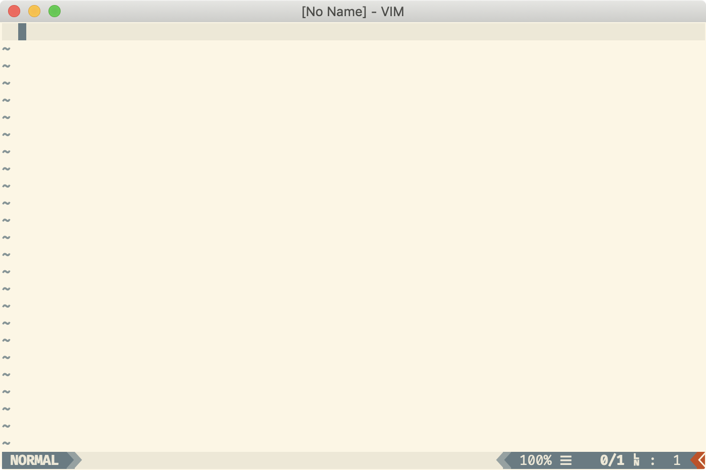

# juev/dotvim

## Pre-requisites

The distribution is designed to work with Vim >= 7.3.

The distribution also requires `git`.

## PreInstall

    $ pip3 install --user pynvim
    $ brew install nvim
    # alias vim = "nvim"

## Installation

**Mac** or **Linux**:

    $ curl https://raw.githubusercontent.com/juev/dotvim/master/install.sh | sh

or shorter:

    $ curl vim.juev.org | sh

Manual install:

    $ git clone https://github.com/juev/dotvim.git ~/.vim
    $ ln -s ~/.vim/vimrc ~/.vimrc
    $ ln -s ~/.vim/gvimrc ~/.gvimrc
    $ mdkir -p ~/.config/nvim
    $ cp init.vim ~/.config/nvim/

Done!

**Windows**:

    > git clone https://github.com/juev/dotvim.git %USERPROFILE%\.vim
    > cd %USERPROFILE%\.vim
    > install.cmd
    > copy vimrc %USERPROFILE%\_vimrc
    > copy gvimrc %USERPROFILE%\_gvimrc

## Appearance

